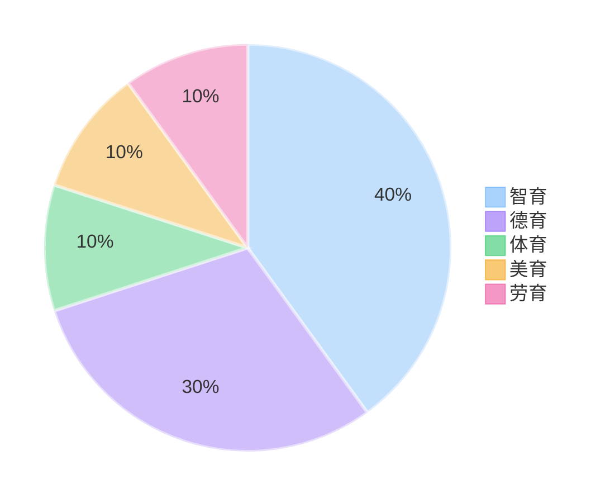

# 奖学金经验分享会

  
分享人：22软件二  王雨欣

  
联系方式：360054589

---
layout: default
---

  

    <h1 class="text-xl font-bold mb-4">综合测评：奖学金评选的关键</h1>
  

  

    

      

        
图1 综测评分占比

      

    

    

      

        <h3 class="text-base font-bold text-blue-400">智育的重要性</h3>
        
作为学生，智育不仅占据最高权重(40%)，更是我们最基本的责任。

      

      

        <h3 class="text-base font-bold text-purple-400">智育构成</h3>
        <ul class="list-disc list-inside">
          <li>课内绩点：绩点×100÷5</li>
          <li>课外加分：学科竞赛、专业证书等</li>
        </ul>
      

      

        <h3 class="text-base font-bold text-pink-400">绩点计算公式</h3>
        
GPA = Σ(课程学分 × 课程绩点) ÷ Σ课程学分

      

    

  

---
layout: default
---

  

    

      <h1 class="text-xl font-bold mb-4">如何获得高绩点</h1>
    
 
    

      

        <h3 class="text-base font-bold text-red-400">关于挂科</h3>
        <ul class="list-disc list-inside space-y-1">
          <li>会失去奖学金评选机会</li>
          <li>补考只能记及格分</li>
          <li>重修需额外付费</li>
        </ul>
        
偶尔因学习困难或遇到苛刻老师而挂科不必过度焦虑，及时调整即可。

      

      

        <h3 class="text-base font-bold text-blue-400">成绩构成</h3>
        <ul class="list-disc list-inside space-y-1">
          <li>平时分、实验分占重要比重</li>
          <li>考勤、作业不容忽视</li>
        </ul>
      

    

  

---
layout: default
---

  

    

      <h1 class="text-xl font-bold mb-4">计算机学习方法</h1>
    
 
    

      

        <h3 class="text-base font-bold text-blue-400">学科特点</h3>
        

          <ul class="list-disc list-inside space-y-1">
            <li>学科范围庞大、交叉领域多</li>
          </ul>
          <ul class="list-disc list-inside space-y-1">
            <li>技术迭代速度快、前沿技术需主动学习</li>
          </ul>
        

      

      

        <h3 class="text-base font-bold text-purple-400">广而不深，学而不精</h3>
        

          <ul class="list-disc list-inside space-y-1">
            <li>注重技术应用、暂缓底层原理</li>
          </ul>
          <ul class="list-disc list-inside space-y-1">
            <li>保持知识面广度、留有发展空间</li>
          </ul>
        

      

      

        <h3 class="text-base font-bold text-green-400">核心基础</h3>
        <ul class="list-disc list-inside space-y-1">
          <li>计算机组成原理、操作系统、计算机网络……</li>
        </ul>
        
这些核心课程是计算机科学的基石，不会过时，需要深入学习。

      

    

  

---
layout: default
---

  

    

      <h1 class="text-xl font-bold mb-4">借力打力</h1>
    
 
    

      

        <h3 class="text-base font-bold text-blue-400">推荐网站</h3>
        

          <ul class="list-none space-y-1">
            <li>GitHub：<a href="https://github.com" class="text-blue-600 hover:underline">https://github.com</a></li>
            <li>Gitee：<a href="https://gitee.com" class="text-blue-600 hover:underline">https://gitee.com</a></li>
            <li>Stack Overflow：<a href="https://stackoverflow.com" class="text-blue-600 hover:underline">https://stackoverflow.com</a></li>
            <li>菜鸟教程：<a href="https://www.runoob.com" class="text-blue-600 hover:underline">https://www.runoob.com</a></li>
          </ul>
          <ul class="list-none space-y-1">
            <li>CSDN：<a href="https://csdn.net" class="text-blue-600 hover:underline">https://csdn.net</a></li>
            <li>小林coding：<a href="https://xiaolincoding.com" class="text-blue-600 hover:underline">https://xiaolincoding.com</a></li>
            <li>bilibili：<a href="https://bilibili.com" class="text-blue-600 hover:underline">https://bilibili.com</a></li>
            <li>edX：<a href="https://www.edx.org" class="text-blue-600 hover:underline">https://www.edx.org</a></li>
          </ul>
        

      

      

        <h3 class="text-base font-bold text-purple-400">算法练习平台</h3>
        

          <ul class="list-none space-y-1">
            <li>力扣：<a href="https://leetcode.cn" class="text-blue-600 hover:underline">https://leetcode.cn</a></li>
            <li>洛谷：<a href="https://www.luogu.com.cn" class="text-blue-600 hover:underline">https://www.luogu.com.cn</a></li>
          </ul>
          <ul class="list-none space-y-1">
            <li>NOJ：<a href="https://acm.njupt.edu.cn" class="text-blue-600 hover:underline">https://acm.njupt.edu.cn</a></li>
            <li>AcWing：<a href="https://www.acwing.com" class="text-blue-600 hover:underline">https://www.acwing.com</a></li>
          </ul>
        

      

    

  

---
layout: default
---

  

    

      <h1 class="text-xl font-bold mb-4">提问的智慧</h1>
    

    

      

        

          

            <h4 class="font-bold text-blue-400">提问前准备</h4>
            <ul class="list-disc list-inside space-y-1 text-gray-700">
              <li>尝试独立解决问题</li>
              <li>善用搜索引擎</li>
              <li>查看文档和日志</li>
              <li>进行debug测试</li>
              <li>……</li>
            </ul>
          

          

            <h4 class="font-bold text-blue-400">提问技巧</h4>
            <ul class="list-disc list-inside space-y-1 text-gray-700">
              <li>问题要明确具体</li>
              <li>描述要清晰完整</li>
              <li>展示尝试过的方法</li>
              <li>保持耐心和礼貌</li>
              <li>……</li>
            </ul>
          

          

            <h4 class="font-bold text-blue-400">心理准备</h4>
            <ul class="list-disc list-inside space-y-1 text-gray-700">
              <li>问题可能很简单</li>
              <li>别人没有遇到过</li>
              <li>对方可能在忙</li>
              <li>……</li>
            </ul>
          

        

        

          
记住：没有自学能力，只会伸手求解的人不适合深入计算机领域。

        

      

    

  

---
layout: default
---

  

    

      <h1 class="text-xl font-bold mb-4">人工智能辅助</h1>
    

    

      

        <h3 class="text-base font-bold text-blue-400 mb-2">AI工具的优势</h3>
        

          <ul class="list-disc list-inside space-y-1 text-gray-700">
            <li>回答常识性问题</li>
            <li>提供个性化代码服务</li>
          </ul>
          <ul class="list-disc list-inside space-y-1 text-gray-700">
            <li>辅助项目开发</li>
            <li>提高开发效率</li>
          </ul>
        

      

      

        <h3 class="text-base font-bold text-purple-400 mb-2">使用注意事项</h3>
        

          

            <h4 class="font-bold text-purple-400 mb-1">AI的局限性</h4>
            <ul class="list-disc list-inside space-y-1 text-gray-700">
              <li>数学计算较弱</li>
              <li>复杂代码易出错</li>
              <li>需要清晰的指令</li>
            </ul>
          

          

            <h4 class="font-bold text-purple-400 mb-1">合理使用建议</h4>
            <ul class="list-disc list-inside space-y-1 text-gray-700">
              <li>减少过度依赖</li>
              <li>建立知识基础</li>
              <li>理解代码原理</li>
            </ul>
          

          

            <h4 class="font-bold text-purple-400 mb-1">实际场景提醒</h4>
            <ul class="list-disc list-inside space-y-1 text-gray-700">
              <li>期末考试无AI辅助</li>
              <li>算法竞赛需独立完成</li>
              <li>面试笔试靠自己</li>
            </ul>
          

        

      

    

  

---
layout: default
---

  

    

      <h1 class="text-xl font-bold mb-4">如何获取高绩点</h1>
    

    

      

        <h3 class="text-base font-bold text-red-400 mb-2">重要警告</h3>
        <ul class="list-disc list-inside space-y-1 text-gray-700">
          <li>严禁考试作弊</li>
          <li>轻则导致挂科无法重修</li>
          <li>严重则取消学位证</li>
        </ul>
      

      

        <h3 class="text-base font-bold text-blue-400 mb-2">复习建议</h3>
        

          <ul class="list-disc list-inside space-y-1 text-gray-700">
            <li>重点复习作业内容</li>
            <li>关注老师划定范围</li>
            <li>完成复习题</li>
          </ul>
          <ul class="list-disc list-inside space-y-1 text-gray-700">
            <li>向学长学姐请教</li>
            <li>参考往年试卷</li>
            <li>保持良好出勤</li>
          </ul>
        

      

    

  

---
layout: default
---

  

    

      <h1 class="text-xl font-bold mb-4">竞赛选择指南</h1>
    

    

      

        <h3 class="text-base font-bold text-blue-400 mb-2">竞赛评判标准</h3>
        

          <ul class="list-disc list-inside space-y-2 text-gray-700">
            <li>获奖率是否过高</li>
            <li>赛制是否规范</li>
          </ul>
          <ul class="list-disc list-inside space-y-2 text-gray-700">
            <li>报名费是否合理</li>
            <li>学校、业内认可度</li>
          </ul>
        

      

      

        <h3 class="text-base font-bold text-purple-400 mb-2">竞赛收益</h3>
        

          

            <ul class="list-disc list-inside space-y-1 text-gray-700">
              <li>综测加分、综合奖学金、创新创业奖学金</li>
              <li>创新创业学分</li>
            </ul>
          

          

            <ul class="list-disc list-inside space-y-1 text-gray-700">
              <li>简历加分项</li>
              <li>个人能力提升</li>
            </ul>
          

        

      

      

        <h3 class="text-base font-bold text-red-400 mb-2">注意事项</h3>
        

          <ul class="list-disc list-inside space-y-1 text-gray-700">
            <li>谨防"报名即获奖"类比赛</li>
          </ul>
          <ul class="list-disc list-inside space-y-1 text-gray-700">
            <li>参考创新创业学院榜单</li>
          </ul>
        

      

    

  

---
layout: default
---

  

    

      <h1 class="text-xl font-bold mb-4">比赛准备指南</h1>
    

    

      

        <h3 class="text-base font-bold text-blue-400 mb-2">赛事时间安排</h3>
        

          <ul class="list-disc list-inside space-y-1 text-gray-700">
            <li>上半年：计算机类比赛</li>
            <li>下半年：数学建模、英语类</li>
          </ul>
          <ul class="list-disc list-inside space-y-1 text-gray-700">
            <li>关注报名和比赛时间</li>
            <li>留意学院集体报名</li>
          </ul>
        

      

      

        <h3 class="text-base font-bold text-purple-400 mb-2">准备建议</h3>
        

          

            <ul class="list-disc list-inside space-y-1 text-gray-700">
              <li>按需学习相关知识</li>
              <li>直接动手实践、遇到问题解决问题</li>
            </ul>
          

          

            <ul class="list-disc list-inside space-y-1 text-gray-700">
              <li>提前联系队友、明确分工合作</li>
              <li>沟通指导老师</li>
            </ul>
          

        

      

      

        <h3 class="text-base font-bold text-amber-400 mb-2">综合能力提升</h3>
        

          <ul class="list-disc list-inside space-y-1 text-gray-700">
            <li>项目文档编写、PPT制作与排版</li>
          </ul>
          <ul class="list-disc list-inside space-y-1 text-gray-700">
            <li>演讲表达技巧、答辩应对能力</li>
          </ul>
        

      

    

  

---
layout: default
---

  

    

      

        

          

          

            

              愿你们在大学四年中不断成长，学有所成，  
              为中华民族的伟大复兴贡献自己的力量！
            

          

        

      

    

  

